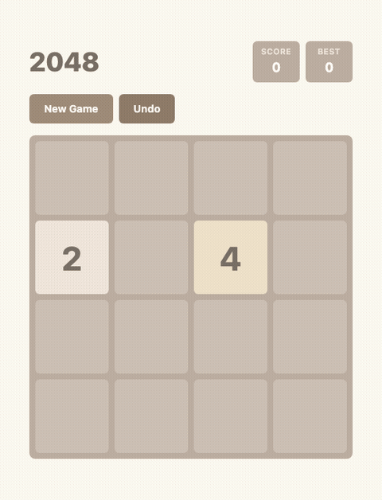
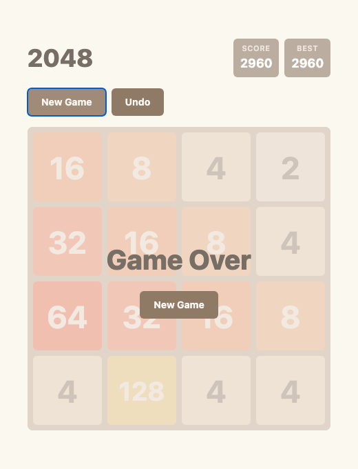

# 2048 — AI Benchmark Platform

<p align="center">
  
</p>

<p align="center">
  <strong>Browser-based 2048 game designed as a benchmark for AI agents.</strong><br/>
  Can your AI play a real GUI game and win?
</p>

<p align="center">
  
  
  
  
</p>

---

## What is this?

A fully functional 2048 game (4×4 grid) built with React + TypeScript, purpose-built as an **AI agent benchmark**. The challenge: an AI must play the game through **real browser interaction** — reading the screen via screenshots, pressing arrow keys, and strategizing to reach 2048.

This tests an AI agent's ability to:

| Capability | Description |
|---|---|
| **Perceive** | Read tile values from browser screenshots |
| **Reason** | Choose optimal moves based on board state |
| **Act** | Execute browser automation (Playwright) reliably |
| **Persist** | Sustain a multi-step task over hundreds of moves |

<p align="center">
  
</p>

---

## Running the Benchmark (Step by Step)

### Prerequisites

- Node.js 20+
- An AI coding agent with shell access (Claude Code, Cursor, Cline, Aider, etc.)

### 1. Give this prompt to each AI agent

Open a separate terminal for each AI. Paste the following as the **entire prompt**:

```
Clone the 2048 AI benchmark repo and play the game to reach the 2048 tile.

git clone https://github.com/lutelute/2048_project.git
cd 2048_project

Read benchmark/prompt.txt for the full instructions, then execute them.
The file contains the complete game rules, setup steps, constraints,
progress logging format, and strategy tips.

Key points:
- Run `npm install` and `npm run dev` to start the game server
- Use Playwright with `headless: false` (visible browser window) to play
- Read the board by taking screenshots, send arrow key presses to make moves
- Write progress to benchmark/results/progress.log (one JSON line per move)
- Save final screenshot as benchmark/results/final.png
- Do NOT modify source code, inject JS, or use Undo

Start now.
```

That's it. Each agent will clone its own copy, install, launch the game, and start playing.

> See [`benchmark/oneliner.md`](benchmark/oneliner.md) for an even shorter variant.

### 2. Monitor progress in real time

Each agent clones the repo into its own `2048_project/` directory. You can watch all of them from a separate terminal:

```bash
# Watch all agents' logs (adjust paths to where each agent's CLI is running)
tail -f /path/to/agent_claude/2048_project/benchmark/results/progress.log \
       /path/to/agent_gpt/2048_project/benchmark/results/progress.log \
       /path/to/agent_gemini/2048_project/benchmark/results/progress.log
```

Each log line is JSON:

```json
{"move":42,"direction":"down","score":1280,"highest":256,"tiles":18,"timestamp":"..."}
```

When an agent finishes:

```json
{"result":"win","score":12345,"highest":2048,"moves":187,"timestamp":"..."}
```

Plus the browser windows stay open so you can see the final board visually.

### 3. Compare results

```bash
# Final result of each agent (last line of each log)
tail -1 /path/to/agent_*/2048_project/benchmark/results/progress.log

# View final screenshots
open /path/to/agent_*/2048_project/benchmark/results/final.png
```

---

## The Benchmark Challenge

### Rules

- **GUI-only**: Must use browser automation (Playwright). No source code modification, no JS injection.
- **Screenshot-based**: Must read the board visually from screenshots.
- **Arrow keys only**: Same inputs as a human player.
- **No Undo**: Each move is final.
- **Single game**: Play from "New Game" to Win/Loss.

### Evaluation Metrics

| Metric | Description |
|---|---|
| Success | Reached 2048? (Pass/Fail) |
| Highest Tile | Max tile value achieved |
| Score | Final game score |
| Moves | Total arrow key presses |
| Efficiency | Score per move |
| Consistency | Win rate over N attempts |

### Difficulty Variants

Edit `src/game/constants.ts` to adjust:

| Variant | `GRID_SIZE` | `WIN_VALUE` | Difficulty |
|---|---|---|---|
| Default (4×4) | 4 | 2048 | Normal |
| Easy (5×5) | 5 | 2048 | Easy |
| Extended (4×4) | 4 | 4096 | Hard |
| Expert (5×5 + 4096) | 5 | 4096 | Expert |

### Full Specification

See [`benchmark/CHALLENGE.md`](benchmark/CHALLENGE.md) for detailed rules, strategy tips, and evaluation criteria.

---

## Game Features

- 4×4 sliding tile grid
- Smooth CSS animations (slide, appear, merge)
- Keyboard (Arrow keys + WASD) and touch/swipe input
- Score tracking with localStorage persistence
- Undo (single step)
- Win/Game Over overlays
- Fully responsive (mobile-friendly)

## Tech Stack

- **React 19** + **TypeScript 5.9**
- **Vite 7** (build tool)
- **Tailwind CSS v4** (`@tailwindcss/vite` plugin)
- **GitHub Pages** (auto-deploy via GitHub Actions)

## Project Structure

```
src/
  game/         # Pure game logic (no React dependency)
    types.ts    # Type definitions
    constants.ts # Grid size, colors, timing
    logic.ts    # Core functions: move, merge, canMove, hasWon
  hooks/        # React hooks
    useGame.ts  # Main state management
    useKeyboard.ts # Arrow key / WASD input
    useSwipe.ts # Touch swipe detection
  components/   # UI components
    Board.tsx, Tile.tsx, Header.tsx, Controls.tsx, GameOverlay.tsx
  utils/
    storage.ts  # localStorage helpers
benchmark/
  prompt.txt    # Prompt to give to AI agents
  CHALLENGE.md  # Full benchmark specification
  watch.sh      # Real-time multi-agent monitor
  capture-demo.mjs # GIF generation script
  assets/       # Demo GIF + screenshots
  results/      # Created by agents (progress.log, final.png)
```

## License

MIT
