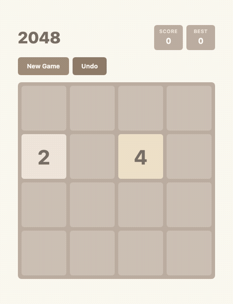
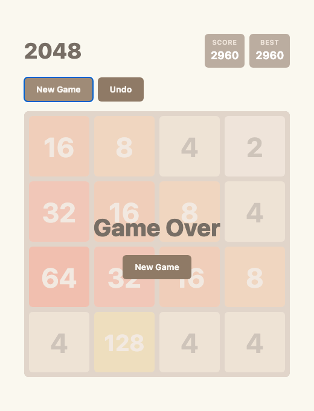

# 2048 — AI Benchmark Platform

<p align="center">
  
</p>

<p align="center">
  <strong>Browser-based 2048 game designed as a benchmark for AI agents.</strong><br/>
  Can your AI play a real GUI game and win?
</p>

<p align="center">
  
  
  
  
</p>

---

## What is this?

A fully functional 2048 game (4x4 grid) built with React + TypeScript, purpose-built as an **AI agent benchmark**. The challenge: an AI must play the game through **real browser interaction** — reading the screen via screenshots, pressing arrow keys, and strategizing to reach 2048.

This tests an AI agent's ability to:

| Capability | Description |
|---|---|
| **Perceive** | Read tile values from browser screenshots |
| **Reason** | Choose optimal moves based on board state |
| **Act** | Execute browser automation (Playwright) reliably |
| **Persist** | Sustain a multi-step task over hundreds of moves |

<p align="center">
  
</p>

---

## Running the Benchmark (Step by Step)

### Prerequisites

- Node.js 20+
- An AI coding agent with shell access (Claude Code, Cursor, Cline, Aider, etc.)

### 1. Give this prompt to each AI agent

Open a separate terminal for each AI. Paste the following as the **entire prompt**:

```
Clone the 2048 AI benchmark repo and play the game to reach the 2048 tile.

git clone https://github.com/lutelute/2048_project.git
cd 2048_project

Read benchmark/prompt.txt for the full instructions, then execute them.
The file contains the complete game rules, setup steps, constraints,
progress logging format, and strategy tips.

Key points:
- Run `npm install` and `npm run dev` to start the game server
- Use Playwright with `headless: false` (visible browser window) to play
- Read the board by taking screenshots, send arrow key presses to make moves
- Write progress to benchmark/results/progress.log (one JSON line per move)
- Save final screenshot as benchmark/results/final.png
- Do NOT modify source code, inject JS, or use Undo

Start now.
```

That's it. Each agent will clone its own copy, install, launch the game, and start playing.

> See [`benchmark/oneliner.md`](benchmark/oneliner.md) for an even shorter variant.

### 2. Monitor progress in real time

```bash
tail -f /path/to/agent_*/2048_project/benchmark/results/progress.log
```

Each log line is JSON:

```json
{"move":42,"direction":"down","score":1280,"highest":256,"tiles":18,"timestamp":"..."}
```

When an agent finishes:

```json
{"result":"win","score":12345,"highest":2048,"moves":187,"timestamp":"..."}
```

### 3. Multi-agent race mode

Run 4 AI agents side-by-side with a real-time dashboard. Each agent plays the game in its own browser window using a heuristic AI, and results are streamed to a live dashboard.

```bash
# 1. Setup (one time only)
#    - Clones the repo into runs/{agent} directories
#    - Symlinks node_modules from the main project (no per-agent npm install)
#    - Deploys play.mjs with correct port for each agent
#    - Checks/installs Playwright Chromium
./benchmark/setup-race.sh

# 2. Launch race
./benchmark/launch-race.sh          # 100 games (default)
./benchmark/launch-race.sh 10       # 10 games
./benchmark/launch-race.sh 50       # 50 games

# 3. Stop all processes
./benchmark/stop-race.sh
```

After `launch-race.sh`, 4 browser windows open automatically and the dashboard is available at `http://localhost:4000`.

You can repeat `stop-race.sh` → `launch-race.sh` as many times as needed — it cleans up previous processes automatically.

| Port | Agent |
|------|-------|
| 4000 | Dashboard |
| 4001 | Claude Code |
| 4002 | Codex |
| 4003 | Gemini CLI |
| 4004 | [Local CLI](https://github.com/lutelute/local-cli) |

> **Note**: Requires Node.js 20+ and macOS. On Node 24, `playwright-core` is used instead of `playwright` to avoid an ESM import hang.
>
> **Note**: Setup and race execution are driven by AI agents (e.g. Claude Code). Because agent behavior is non-deterministic, exact results and execution flow may vary between runs.

### 4. AI Challenge mode (5000番台)

Each AI agent writes its own `chooseMove` function using any strategy (heuristics, Monte Carlo, reinforcement learning, etc.) and competes headlessly at thousands of games per second.

```bash
# 1. Setup (one time) — deploys game engine + baseline AI to each agent
./ai/setup-ai-race.sh

# 2. Launch evaluation
./ai/launch-ai-race.sh           # 200 games (default)
./ai/launch-ai-race.sh 500       # 500 games

# 3. Stop
./ai/stop-ai-race.sh
```

Dashboard: `http://localhost:5050` — shows avg/max score, win rate, tile distribution, score trend charts, and mini board visualizations for each agent.

Each agent implements `ai/my-ai.mjs` exporting:

```js
export default function chooseMove(board, score, game) {
  // board: 4x4 array, game: Game object with .simulateMove(), .clone(), etc.
  return 'down'; // 'up' | 'down' | 'left' | 'right'
}
```

See [`ai/challenge-prompt.txt`](ai/challenge-prompt.txt) for full rules and strategy hints.

---

## The Benchmark Challenge

### Rules

- **GUI-only**: Must use browser automation (Playwright). No source code modification, no JS injection.
- **Screenshot-based**: Must read the board visually from screenshots.
- **Arrow keys only**: Same inputs as a human player.
- **No Undo**: Each move is final.
- **Single game**: Play from "New Game" to Win/Loss.

### Evaluation Metrics

| Metric | Description |
|---|---|
| Success | Reached 2048? (Pass/Fail) |
| Highest Tile | Max tile value achieved |
| Score | Final game score |
| Moves | Total arrow key presses |
| Efficiency | Score per move |
| Consistency | Win rate over N attempts |

### Difficulty Variants

Edit `src/game/constants.ts` to adjust:

| Variant | `GRID_SIZE` | `WIN_VALUE` | Difficulty |
|---|---|---|---|
| Default (4x4) | 4 | 2048 | Normal |
| Easy (5x5) | 5 | 2048 | Easy |
| Extended (4x4) | 4 | 4096 | Hard |
| Expert (5x5 + 4096) | 5 | 4096 | Expert |

### Full Specification

See [`benchmark/CHALLENGE.md`](benchmark/CHALLENGE.md) for detailed rules, strategy tips, and evaluation criteria.

---

## Game Features

- 4x4 sliding tile grid
- Smooth CSS animations (slide, appear, merge)
- Keyboard (Arrow keys + WASD) and touch/swipe input
- Score tracking with localStorage persistence
- Undo (single step)
- Win/Game Over overlays
- Fully responsive (mobile-friendly)

## Tech Stack

- **React 19** + **TypeScript 5.9**
- **Vite 7** (build tool)
- **Tailwind CSS v4** (`@tailwindcss/vite` plugin)
- **GitHub Pages** (auto-deploy via GitHub Actions)

## Project Structure

```
src/
  game/           # Pure game logic (no React dependency)
    types.ts      # Type definitions
    constants.ts  # Grid size, colors, timing
    logic.ts      # Core functions: move, merge, canMove, hasWon
  hooks/          # React hooks
    useGame.ts    # Main state management
    useKeyboard.ts # Arrow key / WASD input
    useSwipe.ts   # Touch swipe detection
  components/     # UI components
    Board.tsx, Tile.tsx, Header.tsx, Controls.tsx, GameOverlay.tsx
  utils/
    storage.ts    # localStorage helpers
benchmark/
  prompt.txt      # Prompt to give to AI agents
  oneliner.md     # One-liner version of the prompt
  CHALLENGE.md    # Full benchmark specification
  play.mjs        # Preset AI auto-play script (single instance)
  dashboard-server.mjs  # Real-time race dashboard server
  dashboard.html  # Dashboard UI
  summarize.mjs   # Result aggregation
  setup-race.sh   # Multi-agent race setup (clone, symlink, Playwright)
  launch-race.sh  # Race launcher (servers + agents + dashboard)
  stop-race.sh    # Stop all race processes
  watch.sh        # Real-time log monitor
  capture-demo.mjs # Demo GIF generation
  assets/         # demo.gif, hero.png
  results/        # Agent output (progress.log, final.png) — gitignored
ai/
  game-engine.mjs       # Headless 2048 engine
  evaluate.mjs          # AI evaluation runner
  my-ai.mjs             # Baseline AI (expectimax) — agents replace this
  challenge-prompt.txt  # Challenge rules for AI agents
  dashboard-ai-server.mjs # Dashboard server (:5050)
  dashboard-ai.html     # Dashboard UI
  setup-ai-race.sh      # AI challenge setup
  launch-ai-race.sh     # AI challenge launcher
  stop-ai-race.sh       # AI challenge stop
runs/             # Per-agent cloned repos — gitignored
```

---

## Architecture: Three Tiers

This project has three tiers of AI benchmarking, each progressively harder:

```
┌─────────────────────────────────────────────────────────────┐
│  4000番台 — Browser Race (Demo)                              │
│  AI plays via Playwright (screenshot → arrow keys)          │
│  Tests: perception, browser automation, persistence         │
│  Ports: 4000-4004  |  Dashboard: localhost:4000             │
├─────────────────────────────────────────────────────────────┤
│  5000番台 — Headless Challenge (Showcase)                    │
│  Preset expectimax AI runs headlessly at high speed         │
│  Tests: heuristic quality, search depth, speed              │
│  Ports: 5050  |  Dashboard: localhost:5050                  │
├─────────────────────────────────────────────────────────────┤
│  6000番台 — AI Self-Improve (Coming Soon)                    │
│  AI agents design & train their own algorithms from scratch │
│  Orchestrator (Claude) narrates progress in real time       │
│  Tests: algorithm design, learning, iteration speed         │
│  Ports: 6000-6004  |  Dashboard: localhost:6000             │
└─────────────────────────────────────────────────────────────┘
```

### 5. AI Self-Improve mode (6000番台) — *Coming Soon*

The ultimate benchmark: each AI coding agent (Claude Code, Codex, Gemini CLI, etc.) receives only the game engine API and a goal — **design, implement, and iteratively improve a 2048 AI from scratch**.

**How it works:**

1. Each agent gets `ai/game-engine.mjs` (the Game API) and a unified instruction prompt
2. The agent must **independently** choose an algorithm (heuristics, expectimax, MCTS, TD learning, N-tuple networks, etc.)
3. The agent implements `chooseMove()`, runs evaluation, reads the results, and **self-improves** in a loop
4. An **orchestrator** (the main Claude session) watches the dashboard and provides **real-time commentary**:
   - "Codex just switched from greedy to expectimax — win rate jumped from 5% to 35%"
   - "Gemini is trying Monte Carlo rollouts but the speed dropped to 0.5 games/sec"
   - "Claude Code added a transposition table — cache hit rate is 40%"

**What makes this different from 5000番台:**

| | 5000番台 | 6000番台 |
|---|---|---|
| AI source | Pre-written baseline | Agent writes from scratch |
| Iteration | Single evaluation | Design → evaluate → improve loop |
| Learning | None (static heuristic) | Agent discovers algorithms autonomously |
| Narration | Dashboard only | Live commentary from orchestrator |
| Goal | Showcase results | Observe the *process* of AI development |

**Evaluation criteria:**

| Metric | Description |
|---|---|
| Final win rate | How reliably the agent's AI reaches 2048 |
| Iteration speed | How fast the agent improves (win rate over time) |
| Algorithm sophistication | Depth of the approach (heuristic → search → learning) |
| Code quality | Readability and correctness of the agent's implementation |
| Self-diagnosis | Can the agent identify why it's losing and fix it? |

**Target:** Each agent should reach >80% win rate through self-improvement, starting from zero.

**Status:** Design phase. Implementation planned for a future session.

---

## License

MIT
