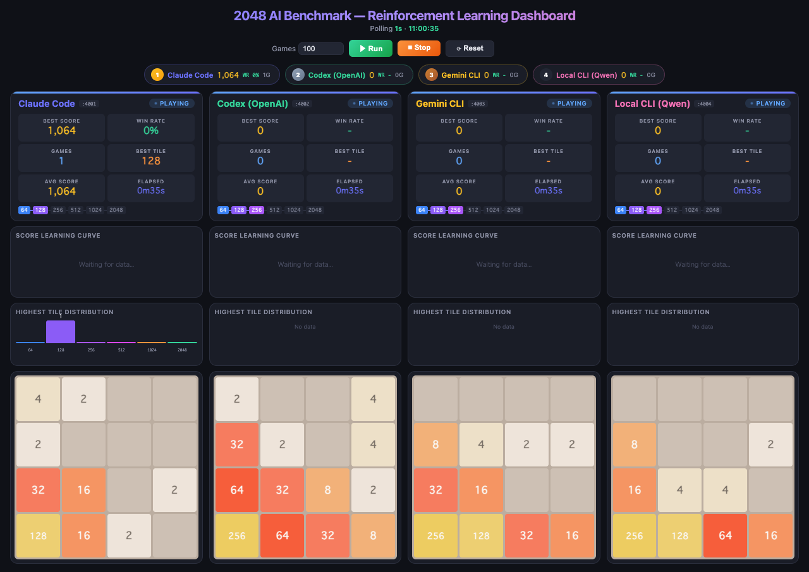

<!-- _class: title -->

# 2048 AI Benchmark Platform
## — AIエージェントを2048で測る3層ベンチマーク —

lutelute

github.com/lutelute/2048_project &ensp;|&ensp; 2026年6月

<!-- note: 4000=ブラウザレース、5000=ヘッドレス評価、6000=自己改善の3層構成。全データは実測値。 -->

---

<!-- _class: agenda -->

# 本日の内容

1. 何を測るか — ベンチマークの設計
2. 3層アーキテクチャ (4000 / 5000 / 6000番台)
3. RL エージェントの仕組みと学習の実証
4. 自己改善ループの実演結果
5. 品質保証とまとめ

---

<!-- _class: rq -->

# Research Question

AIエージェントの「視覚認識・操作・アルゴリズム設計・自己改善」を、単一のゲームでどう定量比較するか？

— 2048 を共通課題に、難易度の異なる3層のベンチマークを構成する

---

<!-- _class: stack -->

# 3層アーキテクチャ — ポート番号が難易度層

  4000番台 — ブラウザレース
  React製2048を Playwright で実機操作。スクショ読取→キー入力。4エージェント同時レースをダッシュボード観戦

  5000番台 — ヘッドレスAI評価
  ブラウザなし・750+ games/sec。random / greedy / montecarlo / expectimax / rl + 自作AI (my-ai.mjs)

  6000番台 — AI自己改善
  AI CLI (claude / codex / gemini) が自分でコードを書き換え、評価→改善のループを自走

<!-- note: ゲームロジックはReact版とヘッドレス版で28件のパリティテストにより同一性を保証。盤面UIも3層で統一済み。 -->

---

<!-- _class: figure -->

# 4000番台 — ブラウザレース

Fig. 1. レースダッシュボード (:4000)。4エージェントの順位・学習曲線・統一盤面をライブ表示。

- **2秒**でレース起動 (残骸・二重起動・ポート占有があっても自動回復)
- 実ブラウザ4枚が自動プレイ — スクショ読取→キー操作の **GUI-only ルール** (DOM覗き見・ソース改造は禁止)

---

<!-- _class: chart -->
<!-- _chart: column -->

# 5000番台 — アルゴリズム別の平均スコア (実測)

| アルゴリズム | 平均スコア |
|---|---|
| random | 1114 |
| greedy | 3086 |
| montecarlo | 12000 |
| expectimax | 21370 |
| rl (学習済み) | 29086 |

各50〜200ゲームの実測平均。rl は約25万ゲーム事前学習済みモデル使用時 (勝率63%・最大タイル4096)。

---

<!-- _class: equation -->

# RL の学習則 — Afterstate TD(0)

$$V(s'_{t-1}) \;\leftarrow\; V(s'_{t-1}) \;+\; \alpha \,\bigl( r_t + V(s'_t) - V(s'_{t-1}) \bigr)$$

  $V(\cdot)$
  盤面価値 — 12本の 4-tuple LUT (行4+列4+2×2正方形4) で近似
  $s'_t$
  afterstate (手を打った直後・新タイル出現前の盤面)
  $r_t$
  即時報酬 (マージで得たスコア)
  $\alpha$
  学習率 0.1 (8対称 × 12タプル = 96 で正規化)

Szubert & Jaśkowski (2014) の N-tuple network。盤面の8対称 (回転4×反転2) で重みを共有。

---

<!-- _class: table-slide -->

# 学習は常時オン — 「プレイ = 学習」

## 実行モードの違いは開始点と保存だけ

| モード | 重みの開始点 | 学習 | 保存 |
|------|:------:|:----:|:----:|
| ダッシュボード Run (既定) | 学習済み rl-model.bin | **毎手リアルタイム** | なし (揮発) |
| `RL_LOAD=0` | ゼロ | 毎手リアルタイム | なし |
| `RL_SAVE=1 RL_LOAD=0` | ゼロ | 毎手リアルタイム | 終了時に保存 |

**推論専用モードは存在しない**: chooseMove が呼ばれるたびに TD(0) 更新が走る。普段見ている rl は「25万ゲームの事前学習 + 走行中のリアルタイム学習」

---

<!-- _class: chart -->
<!-- _chart: line -->

# 学習の実証 — ゼロから1,000ゲーム (所要1.3秒)

| ゲーム数 | 平均スコア |
|---|---|
| 100 | 2274 |
| 200 | 3047 |
| 300 | 4037 |
| 400 | 4594 |
| 500 | 4804 |
| 600 | 5624 |
| 700 | 5746 |
| 800 | 6566 |
| 900 | 6920 |
| 1000 | 6912 |

RL_LOAD=0 で重みゼロから開始。100ゲームごとの平均スコア。最大タイルは 512 → 1024 に成長。

---

<!-- _class: zone-process -->

# 6000番台 — 自己改善ループ (エージェント役で実演)

  1
  コードを書く
  my-ai.mjs に chooseMove を実装 (初期状態は random)

  2
  evaluate 実行
  node ai/evaluate.mjs --games 50 で自己評価

  3
  結果を読む
  平均スコア・勝率・タイル分布から弱点を分析

  4
  改善して再挑戦
  greedy → expectimax と段階改善。run 履歴はダッシュボードに記録

---

<!-- _class: big-number -->
<!-- source: 実演: runs/claude-code の selfimp-0/1/2 (各50ゲーム) -->

# 自己改善の実演結果

  19×
  スコア改善 (3ステップ)
  random 1,114 → greedy 3,086 → expectimax 21,370 (勝率42%)

---

<!-- _class: kpi -->

# 品質保証 — 壊れないための仕組み

  67
  ユニットテスト (パリティ28件含む)

  38
  E2E 実ブラウザ検証 (3層 15+8+15)

  25s
  CI 所要時間 (push 毎に全テスト)

  2〜6s
  レース起動 (どの状態からでも)

<!-- note: SEED指定でタイル出現が決定論的になり、結果が再現可能。Node24のplaywright installハングはシステムChromeで回避。 -->

---

<!-- _class: takeaway -->

# キーメッセージ

2048 ひとつで、AIの「見る・操作する・設計する・育つ」を同じ土俵で測れる

<li>3層構成: ブラウザ実機レース → 高速ヘッドレス評価 → 自己改善ループ</li>
<li>RL は毎手リアルタイム学習 — ゼロから1,000ゲーム(1.3秒)で平均スコア3倍を実測</li>
<li>テスト・CI・SEED再現性・統一盤面UIまで整備済み、コマンド一発でデモ可能</li>

---

<!-- _class: end -->

# Thank you

./benchmark/launch-race.sh 10 で今すぐ観戦できます

github.com/lutelute/2048_project
